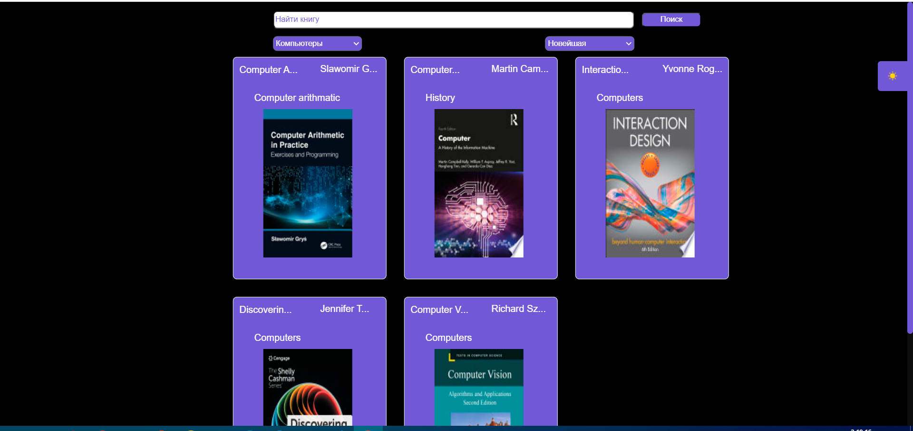
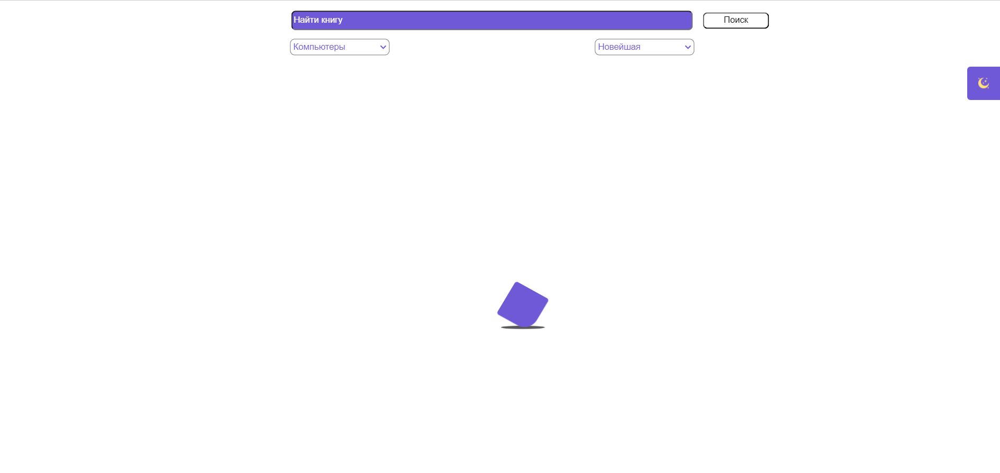

# Тестовое задание frontend

# Стек технологий 
- React
- Redux
- JS
- CSS
- Docker

# Запуск приложения 

- установите докер
- собирите сборку (docker-compose up --build)
- запуск (docker-compose up)

**Test** 
**Test** 
**Test** 
